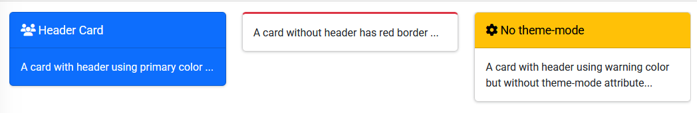
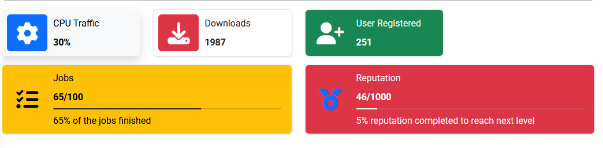
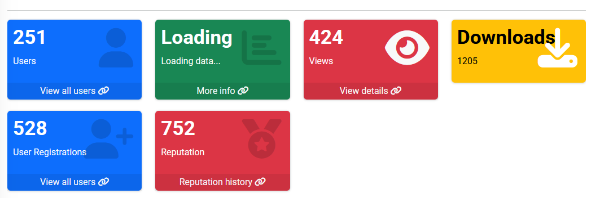
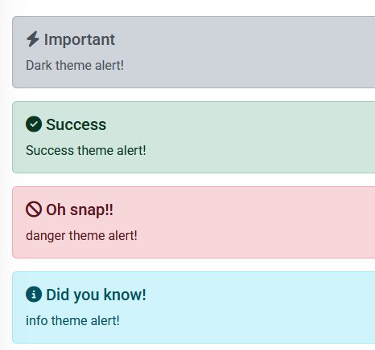

# Hawkiq AdmLTE Package

[](https://packagist.org/packages/hawkiq/admlte)


- This Package Heavely Inspired by [Laravel-AdminLTE](https://github.com/jeroennoten/Laravel-AdminLTE) for AdminLTEv3, I used thier Components with few modifications to make it suitable for AdminLTEv4.
---

Hawkiq AdmLTE is a Laravel package designed for seamless integration of the AdminLTE v4 beta template, providing a robust foundation for admin dashboards. This package simplifies the installation, configuration, and usage of AdminLTE with Bootstrap 5 and related components.

---

## Installation

Follow these steps to install and set up the Hawkiq AdmLTE package:

### Step 1: Require the Package

Add the package to your Laravel project via Composer:

```bash
composer require hawkiq/admlte
```

### Step 2: Publish Assets, Lang, and Configurations

Run the following Artisan command to publish the package's assets,language and configuration files:
```bash
php artisan admlte:install
```

This will:
- Copy AdminLTE assets (CSS, JS, images) to `public/vendor`.
- Publish the configuration file to `config/admlte.php`.
- Publish Languages files to `lang/` or `resources/lang/`.

### Step 3: Replace Auth Views ( Optional )

If you would like to use AdminLTE Auth views you can run below command to replace views:

```bash
php artisan admlte:install --only=auth_views
```
this step is safe since its taking backup in `storage` folder for current views so if anything wrong happened you can always restoring old views.

---

## Configuration

Customize the package by editing the configuration file located at:
```bash
config/admlte.php
```

Key configurations include:
- Sidebar links and permissions.
- Navbar components.
- Custom assets and scripts.

Example `config/admlte.php`:
```php
return [
    'sidebar' => [
        [
            'type' => 'header',
            'text' => 'main.navigation',
            'permission' => null,
        ],
        [
            'type' => 'link',
            'text' => 'Dashboard',
            'route' => 'test1',
            'icon' => 'fas fa-home',
            'permission' => null,
        ],
          [
            'type' => 'link',
            'text' => 'Test Link',
            'route' => 'test2',
            'icon' => 'fas fa-cog',
            'permission' => null,
        ],
    ],
];
```

---

## Usage

### Include the Layout
To use the package's layout, extend the base layout in your Blade files:

```blade
@extends('admlte::page')
```
If you want to include auth layout just use AdmLTE auth layouts:

#### for login page
```blade
@extends('admlte::auth.login')

```

#### for register page
```blade
@extends('admlte::auth.register')

```

# Customizing Views
If you need to customize views,
```bash
php artisan admlte::install --only=views
```
- Publish customizable views to `resources/views/vendor/admlte`.

---
# Using with Vite
if you prefer to Use asset bundling using vite you have to make few adjestments to your project.
No need to install more packages just small change to your `vite.config.js` file.
add this 
```js
import path from "path";

export default defineConfig({
    plugins: [
        laravel({
            input: ["resources/css/app.css", "resources/js/app.js"],
            refresh: true,
        }),
    ],
    resolve: { // Add this block resolve
        alias: {
            "@vendor": path.resolve(__dirname, "public/vendor"),
        },
    },
});

```

then go to resources folder in your project edit `app.css` and `app.js` .

app.css

```css
@import "@vendor/adminlte/css/adminlte.min.css";
@import "@vendor/font-awesome/css/all.min.css";
```
app.js
```js
import "@vendor/jquery/jquery.min.js"; // Add this if You want to use jquery
import "@vendor/bootstrap/js/bootstrap.bundle.min.js";
import "@vendor/adminlte/js/adminlte.js";

```

then run command `npm run dev` , dont forget to activate vite option in `config/admlte.php`

```php
    /*
    |--------------------------------------------------------------------------
    | Assets Bundling ( Experimental )
    |--------------------------------------------------------------------------
    |
    | Default behavouir is assets from public vendor as files But If you prefer.
    | Using vite bundling you can mark this option as true.notice this is just 
    | Test feature done during testing filament So it might works as you desire .
    |
    */

    'vite' => true,

```
# Widgets
I've created few widget for easy use in your project, I'll try to make more in near future. all widgets use bootstrap 5 color names ( primary - success - danger - warning - light - dark - secondary ), till now there are no AdminLTE colors.

## Card
To create Cards with minimal efforts you can use Card widget and pass the required informations to make it works, here are few examples, when I create a wiki page I will give full details on each component.
```html

<x-admlte-card icon="fas fa-users" theme-mode="full" title="Header Card" theme="primary">
    A card with header using primary color ...
</x-admlte-card>

<x-admlte-card theme="danger" theme-mode="outline">
    A card without header has red border ...
</x-admlte-card>

<x-admlte-card icon="fas fa-cog" title="No theme-mode" theme="warning">
    A card with header using warning color but without theme-mode attribute...
</x-admlte-card>
```




## Info Box
For display small infos with icons or progress bar 

```html

<x-admlte-info-box class="shadow" title="CPU Traffic" text="424" icon-theme="primary"
    icon="fas fa-lg fa-cog" theme="light" />

<x-admlte-info-box title="Downloads" text="1205" icon="fas fa-lg fa-download"
    icon-theme="danger" />

<x-admlte-info-box title="User Registrations" text="251" icon="fas fa-lg fa-user-plus"
    theme="success" />

<x-admlte-info-box title="Tasks" text="75/100" icon="fas fa-lg fa-tasks" theme="warning"
    progress=75 progress-theme="dark" description="75% of the tasks have been completed" />

<!-- Updatable -->
<x-admlte-info-box title="Reputation" text="0/1000" icon="fas fa-lg fa-medal text-dark"
    theme="danger" id="ibUpdatable" progress=0 progress-theme="teal"
    description="0% reputation completed to reach next level" />
                

```

you can test `updateable` Info box with this js code

```html
<script>
    $(document).ready(function() {

        let iBox = new _AdminLTE_InfoBox('ibUpdatable');

        let updateIBox = () => {
            // Update data.
            let rep = Math.floor(1000 * Math.random());
            let idx = rep < 100 ? 0 : (rep > 500 ? 2 : 1);
            let progress = Math.round(rep * 100 / 1000);
            let text = rep + '/1000';
            let icon = 'fas fa-lg fa-medal ' + ['text-primary', 'text-light', 'text-warning'][idx];
            let description = progress + '% reputation completed to reach next level';

            let data = {
                text,
                icon,
                description,
                progress
            };
            iBox.update(data);
        };

        setInterval(updateIBox, 5000);
    })
</script>

```



## Small Box
For display one info with beautiful UI

```html

<x-admlte-small-box theme="primary" title="251" text="Users" icon="fas fa-user" url="#"
    url-text="View all users" url-icon="fas fa-link" />


<x-admlte-small-box title="Loading" text="Loading data..." icon="fas fa-chart-bar" theme="success"
    url="#" url-text="More info" />

<x-admlte-small-box title="424" text="Views" icon="fas fa-eye text-light" theme="danger"
    url="#" url-text="View details" />

<x-admlte-small-box title="Downloads" text="1205" icon="fas fa-download text-white"
    theme="warning" />

<x-admlte-small-box title="528" text="User Registrations" icon="fas fa-user-plus text-teal"
    theme="primary" url="#" url-text="View all users" />

<x-admlte-small-box title="0" text="Reputation" icon="fas fa-medal" theme="danger"
    url="#" url-text="Reputation history" id="sbUpdatable" />


```


## Alert
For display alerts 

```html
<x-admlte-alert theme="dark" title="Important">
    Dark theme alert!
</x-admlte-alert>

<x-admlte-alert theme="success" title="Success">
    Success theme alert!
</x-admlte-alert>


<x-admlte-alert theme="danger" title="Oh snap!!">
    danger theme alert!
</x-admlte-alert>


<x-admlte-alert theme="info" title="Did you know!">
    info theme alert!
</x-admlte-alert>


```


---

## Contribution
Contributions are welcome! Feel free to fork the repository and submit a pull request.

---

## License
This package is open-sourced software licensed under the [MIT license](LICENSE).

